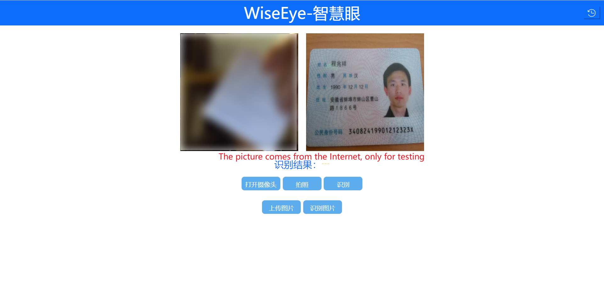
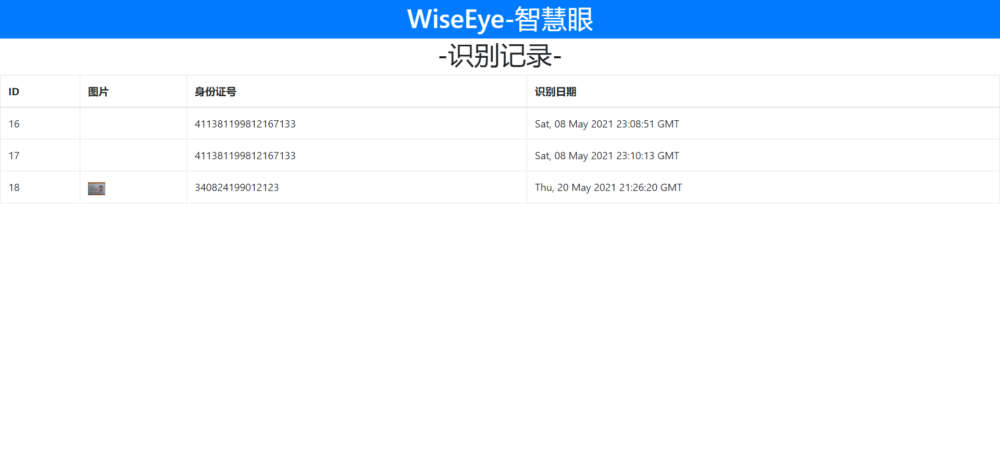
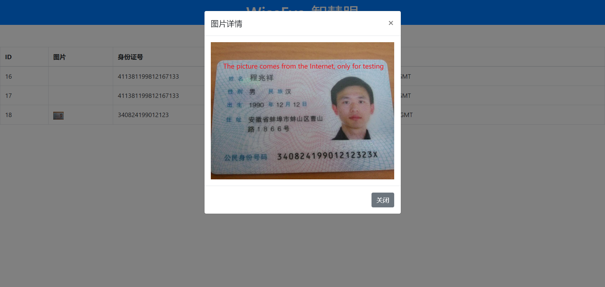

## Preview
`Wise_Eye`是一个基于Python Flask 的身份证识别系统，完成了下面的功能：
    1. 摄像头识别
    2. 图片识别
    3. 识别数据持久化 （MySQL5.7）

! 注：该项目为代别人完成的毕业设计部分功能，身份证识别使用了 Azure 的 OCR 接口，
因此该项目并未使用任何图像识别的算法，
仅仅是使用了 Flask 来搭建了一个前后端的服务框架。






## Start
1. 安装 venv 虚拟环境，并进入
```shell
python -m venv venv
```

```shell
# 进入虚拟环境
# windows 下，项目根目录执行
.\venv\Scripts\activate.bat
```
2. 安装所需库
```shell
pip install -r requirements.txt 
```
3. 创建数据库，并修改项目配置

    在自己 MySQL 下新建一个数据库
    并将项目根目录 `config.py` 的配置改为自己的配置
   
4. 运行：
```shell
flask run
```
然后访问：[127.0.0.1:5000](127.0.0.1:5000)

## 项目技术栈及重点介绍
本项目是一个基于前后端的身份证识别项目。

- 后端使用 Python 的 Flask 框架，提供相关数据接口

- 前端使用 H5+CSS3+JavaScript 及其 Jquery,BootStrap 框架来构建页面和利用 AjAx 调用后端接口

项目文件架构：

-- db 数据库脚本文件

-- static 所用静态资源 （css,js,image等，其中 uploads 为文件上传后保存地址）

-- templates 前端 Html 页面

-- venv Python 虚拟环境文件夹

-- app.py 项目后端主程序，提供相关接口

-- config.py 项目配置文件

-- picture_recognition.py 图像识别接口

-- requirements.txt 项目所需依赖库


大概流程：

前端拍照或上传图片后，将图片放置到右边的的 img 标签内，用户点击“识别”按钮后，前端会使用 AJax 将图片封装成一个文件对象，提交至后端的接口。

后端接口接收到文件后会先将文件处理为 opencv 所支持的格式，然后调用识别接口进行识别。识别到身份证账号后会返回一个 JSON 数据。

然后使用正则表达式获取到身份证号码信息成功后，保存图片到相应文件夹，保存信息到数据库。同时返回 状态码（status）和身份证号码(code)

进入历史记录页面后，前端会自动调用 AjAx 请求数据库内的所有数据，然后一行一行放入数组，最后使用 bootStrap-Table 将数据放入表格。


## 其他备注

外部访问参数：
```xml
--host=0.0.0.0 --port=9000
```

安装`cv2`:
```shell
pip install -i https://pypi.tuna.tsinghua.edu.cn/simple opencv-python
```